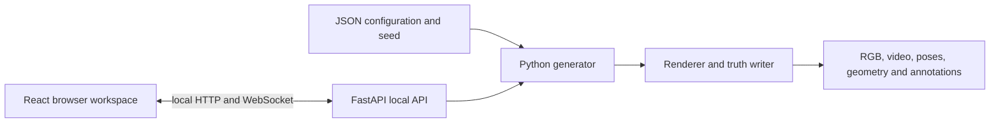

# Architecture

LumenMorph separates reproducible sequence generation from interactive design.
The generator is the authoritative source of dataset content; the user
interfaces create, normalize and submit configurations to it.

## Components

| Component | Location | Role |
| --- | --- | --- |
| Generator and validator | `backend/src/` | Builds plane and tubular sequences, writes annotations, and checks a generated dataset. |
| Command-line interface | `backend/src/cli.py` | Scriptable `generate`, `validate`, `preview`, and `api` commands. |
| Local API | `backend/src/api/` | Configuration normalization, preview sessions, generation jobs, and progress reporting. |
| Supported browser workspace | `frontend/` | The primary interactive tube-design workflow. |
| Configurations | `configs/` | Versioned example and benchmark configurations. |
| Benchmark tools | `backend/src/benchmark*.py` | Production, reading, QA, and evaluation helpers for the fixed tubular bank. |

## Interface policy

The React workspace is the supported public UI. It is tested with linting,
unit tests, and production builds.

The API is a local companion service. It accepts configuration and output paths
and can write datasets, so it must be bound only to a trusted machine. Its
default host is `127.0.0.1`; do not expose it directly to a network or the
public internet.

## Data and truth boundaries

The generic generator writes RGB observations, camera metadata, mesh states,
and deformation information. The fixed Paper 0 benchmark adds a documented
release schema and evaluation protocol. Use the corresponding reader and
evaluator rather than assuming every generic output has all benchmark fields.

Synthetic geometry and prescribed motion are exact for the generated scene.
They are not evidence that the anatomy or material model represents clinical
tissue. The [reproducibility guide](REPRODUCIBILITY.md) and benchmark
documentation define those limits.
