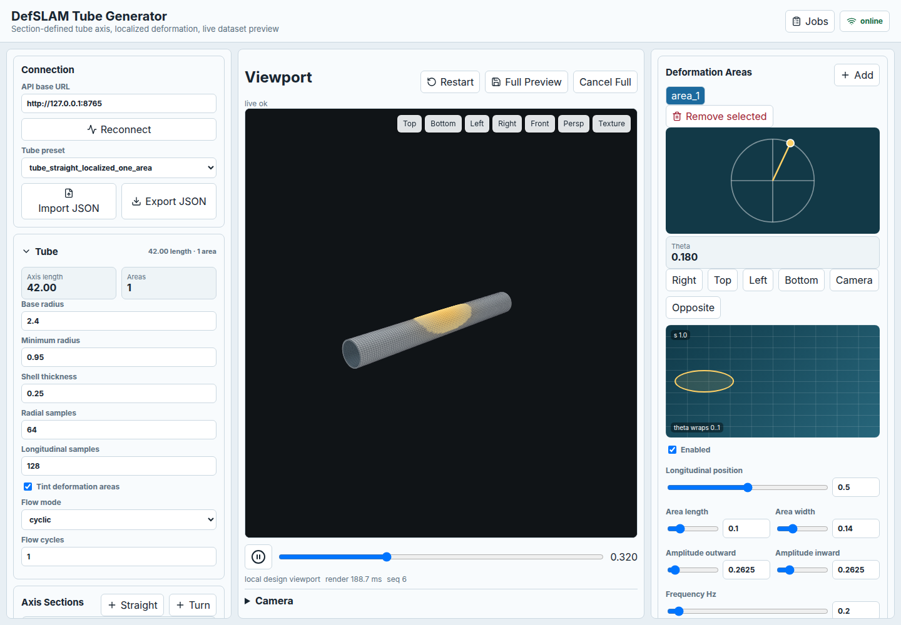
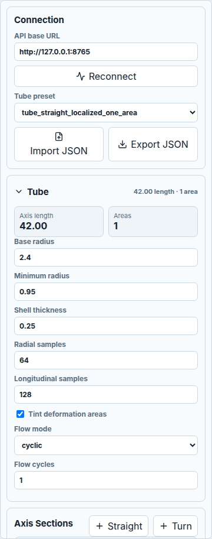
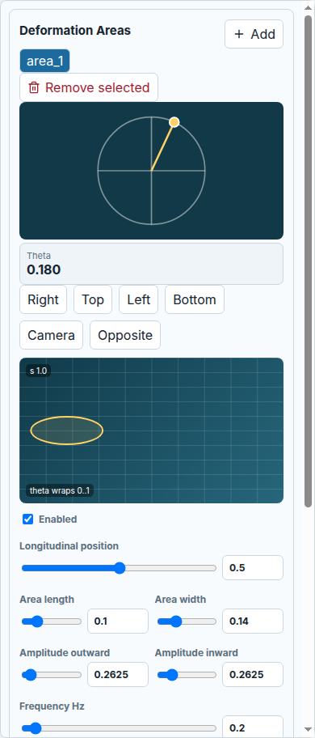
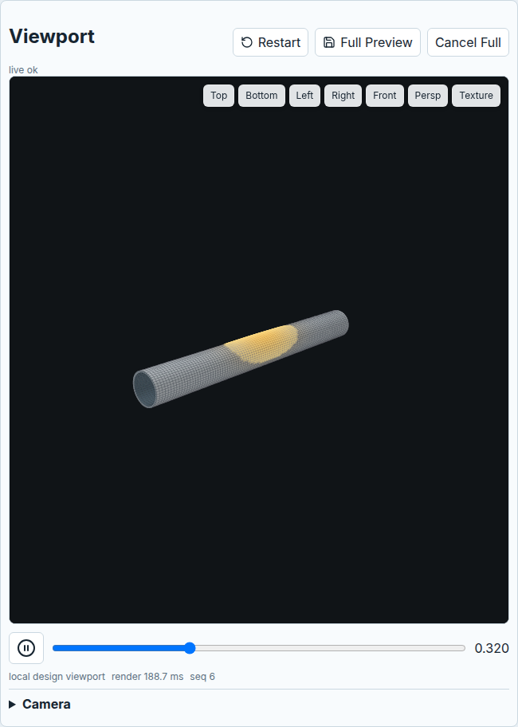
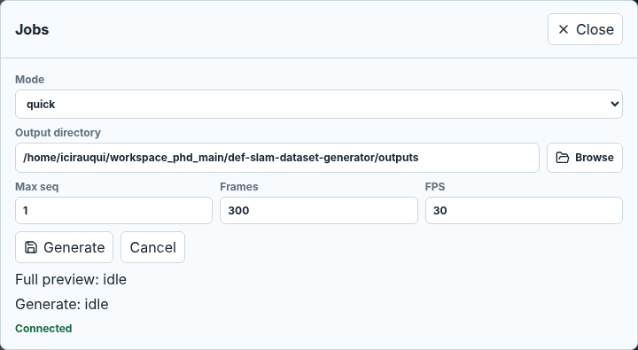

# Tube Dataset User Guide

This guide covers the supported browser workflow for generating a tube dataset
with the LumenMorph React workspace and local FastAPI backend.

## Start The App

If this is a fresh checkout, install dependencies first:

```bash
uv sync --project backend --locked
npm --prefix frontend ci
```

Run the backend from the repository root:

```bash
backend/.venv/bin/python -m backend.src.cli api --host 127.0.0.1 --port 8765
```

Run the browser workspace in another terminal:

```bash
npm --prefix frontend run dev -- --host 127.0.0.1 --port 5173
```

Open:

```text
http://127.0.0.1:5173
```

The header should show `online`. If it shows `offline`, confirm the backend is running and that the API base URL is `http://127.0.0.1:8765`, then click `Reconnect`.



## Create A Basic Tube

1. In `Tube preset`, choose a tube preset such as `tube_straight_localized_one_area`.
2. In the collapsible `Tube` panel, set the main dimensions:
   - `Base radius`: nominal tube radius.
   - `Minimum radius`: inward deformation clamp. Keep this positive and below the base radius.
   - `Shell thickness`: visible tube wall thickness in the design viewport.
   - `Radial samples`: points around each tube ring.
   - `Longitudinal samples`: rings along the tube axis.
   - `cap_ends` in exported JSON closes the finite synthetic mesh. Enable it
     when the sequence must never expose the renderer background through the
     terminal tube boundary.
   - `End margin distance` in exported JSON keeps an unseen terminal section
     beyond the camera target. Increase it for wide-angle cameras if the open
     tube boundary becomes visible near the end of a sequence.
3. Use `Tint deformation areas` while editing. This makes localized deformation regions visible in the preview.
4. Set `Flow mode`:
   - `cyclic`: deformation oscillates through the sequence and returns smoothly.
   - `linear`: deformation travels in one direction over the sequence.



## Build The Tube Axis

The tube axis is an ordered list of sections. The app derives total tube length from the section list. Each section card can be collapsed; the collapsed title summarizes the section, for example `straight 5` or `turn right 30-5`.

Use `+ Straight` for a straight section:

```text
kind: straight
length: section length
```

Use `+ Turn` for a bend:

```text
kind: turn
direction: up, down, left, or right
angle_deg: bend angle
radius: turn radius
```

For a turn, arc length is:

```text
abs(angle_rad) * radius
```

Keep the first run simple: start with one straight section, confirm preview works, then add turns one at a time.

## Add A Deformation Area

Use the `Deformation Areas` panel to define localized sources of movement.

1. Click `+ Add` to create an area.
2. Use the circular editor to set `center_theta`, the position around the tube circumference.
3. Use the rectangular map to set:
   - Horizontal position: `center_theta`, wrapped from 0 to 1.
   - Vertical position: `center_s`, normalized along the tube axis.
4. Enable the area with `Enabled`.
5. Set the area size:
   - `Area length`: longitudinal footprint.
   - `Area width`: angular footprint around the tube.
6. Set amplitude:
   - `Amplitude outward`: positive radial amplitude. The slider range scales with the tube radius, and typed values can extend it.
   - `Amplitude inward`: inward amplitude. The backend clamps this by `Minimum radius`.
7. Set `Frequency Hz` and `Phase radians`.
8. Keep `Mode` as `radial` for the first dataset.



The deformation direction is a local tube vector:

```text
Radial dir: outward/inward surface normal
Tangent dir: along the tube axis
Circ dir: around the circumference
```

The circular editor uses the same top/bottom convention as generated frames: `Top` maps to the top of the rendered/exported tube. The default direction is radial:

```text
radial = 1
tangent = 0
circumferential = 0
```

Use non-radial components only when you need local sliding or twisting deformation. Tube V2 stores the resulting per-frame displacement as a 3D displacement grid.

## Check The Preview

The center viewport updates from the live preview stream.

Useful controls:

- `Restart`: recreate the preview session after large config changes.
- `Full Preview`: render a complete preview job.
- Scrubber: inspect normalized time through the sequence.
- Pause/play: stop or resume live playback.
- Drag in the viewport: orbit the preview camera.
- Mouse wheel: zoom.
- Shift + mouse wheel: adjust field of view.
- Double-click: reset the preview camera.
- `Top`, `Bottom`, `Left`, `Right`, `Front`, and `Persp`: jump to common viewpoints.
- `Texture`: toggle textured backend preview versus the faster local gray design viewport. Dataset export still uses the texture.



Before generating, confirm:

- Status near the viewport says `live ok`.
- The tube geometry matches the section list.
- Deformation tint appears where expected.
- The tube does not collapse below the intended minimum radius.

## Generate A Dataset

Click `Jobs` in the top bar to open the generation overlay.

1. Set `Mode` to `quick` for the first run.
2. Check `Output directory`. By default the backend uses the repository `outputs/` folder, for example:

```text
/home/.../LumenMorph/outputs
```

3. Use `Browse` if you want the backend to open a native directory picker. This works only when the backend process has access to a desktop session; otherwise type a backend-local path directly.
4. Set `Max seq` to `1`.
5. `Frames` and `FPS` default to the selected sequence values. Override them only for quick test runs.
6. Click `Generate`.



The output directory is interpreted by the backend process, not by the browser. Missing directories are created during generation. Relative paths are resolved from the repository root.

Use `Cancel` to stop a running generation job.

## Validate The Result

After generation finishes, validate the dataset from the repository root. If you used the default location, validate:

```bash
backend/.venv/bin/python -m backend.src.cli validate --dataset outputs
```

If you typed a custom path, validate that path instead:

```bash
backend/.venv/bin/python -m backend.src.cli validate --dataset /tmp/tube_dataset
```

A generated dataset contains:

```text
dataset_manifest.json
config_used.json
train/
val/
test/
```

Each sequence contains:

```text
frames/
preview.mp4
intrinsics.json
poses.csv
deformation_params.csv
mesh_static.npz
mesh_z/
sequence_meta.json
```

For Tube V2, `sequence_meta.json` uses:

```text
mesh_state_type: tube_displacement_xyz_grid
```

The per-frame `mesh_z/*.npy` files store a longitudinal by radial by xyz displacement grid.

## Save Or Load A Configuration

Use `Export JSON` to download the current Tube V2 configuration.

Use `Import JSON` to load a saved configuration. Legacy tube configs are migrated on load and normalized exports use the Tube V2 shape:

```text
tube.axis.sections
tube.dimensions
tube.surface
tube.camera
tube.deformation.areas
```

## Troubleshooting

`offline` status:

- Confirm the backend command is still running.
- Confirm the API URL is `http://127.0.0.1:8765`.
- Click `Reconnect`.

Preview is black or stale:

- Click `Restart`.
- Reduce `Radial samples` or `Longitudinal samples` while editing.
- Confirm at least one axis section has a positive length or turn radius.

Generation is slow:

- Use `quick` mode.
- Set `Max seq` to `1`.
- Set a lower `Frames` override for test runs.
- Lower radial and longitudinal samples while designing the tube.

Output files are not where expected:

- Remember that the output directory is local to the backend process.
- Use the default `outputs/` folder or an absolute path during testing, such as `/tmp/tube_dataset`.
- If `Browse` does not open a picker, the backend is likely running headless or remotely; type the path manually.
